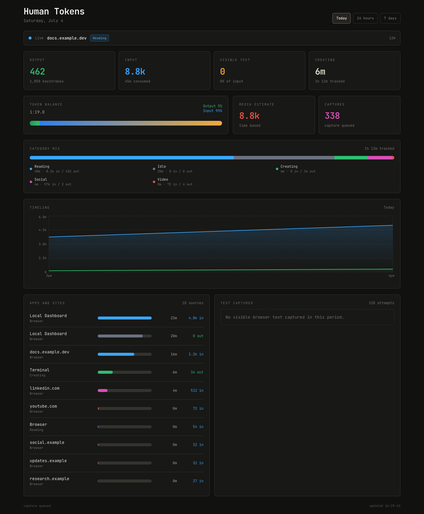

# Human Tokens

[Homepage](https://iamunbounded.github.io/human-tokens/) | [Repository](https://github.com/IAmUnbounded/human-tokens)

Human Tokens is a local-first tracker for understanding the balance between what you create and what you consume. It records active app/session context, estimates output from keystrokes, estimates input from reading/media/AI activity, and presents the result as an input:output dashboard.



## What This Is

The goal is to make personal attention measurable without turning it into a cloud product. Human Tokens is being shaped as a small local system:

- A macOS tracker that records active apps, windows, categories, idle time, and keystroke-derived output.
- Input estimates for reading, AI chats, video, social feeds, communication, and visible browser text.
- A Next.js dashboard that shows output, input, token balance, category mix, app/source breakdowns, and timelines.
- Daily reports that make attention patterns easier to review.

## Why

Humans have context windows too. This repo is trying to make that window visible: how much of the day was spent producing, how much was spent consuming, and which tools or sources shifted that balance.

## Local Commands

```bash
npm run install:dashboard
npm run track:bg
npm run dev
npm run report
```

## Browser Text Capture

Chrome-based browsers need JavaScript execution from Apple Events for visible text capture. If the dashboard shows capture attempts but `0` visible text, enable:

```text
View > Developer > Allow JavaScript from Apple Events
```

The tracker can still record browser app, tab title, and URL without this setting, but page text tokens require it.

## Star History

<a href="https://star-history.com/#IAmUnbounded/human-tokens&Date">
  <picture>
    <source media="(prefers-color-scheme: dark)" srcset="https://api.star-history.com/svg?repos=IAmUnbounded/human-tokens&type=Date&theme=dark" />
    <source media="(prefers-color-scheme: light)" srcset="https://api.star-history.com/svg?repos=IAmUnbounded/human-tokens&type=Date" />
    
  </picture>
</a>
